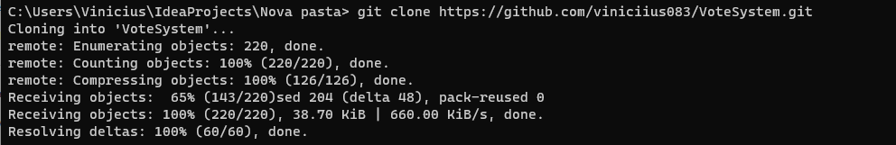
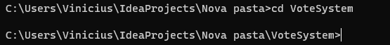
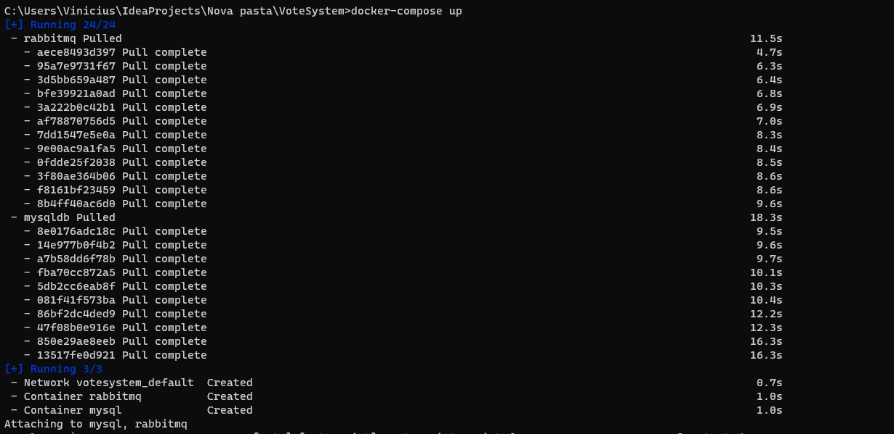
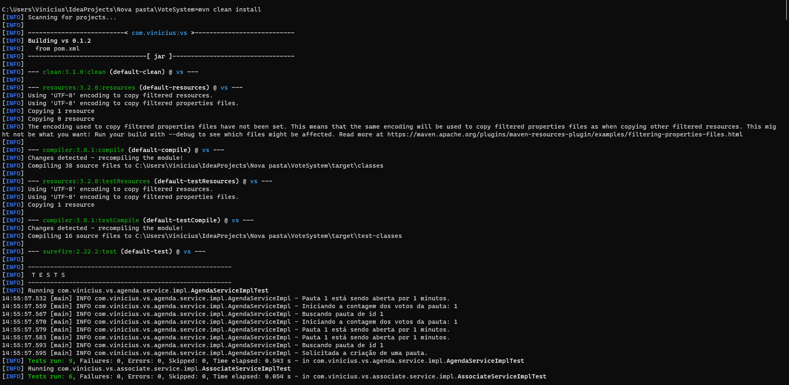
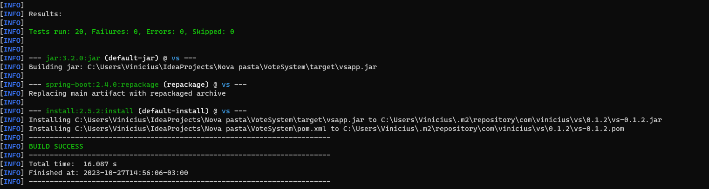
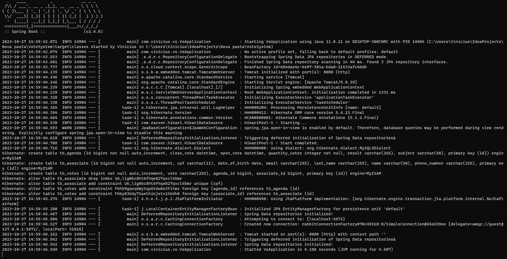
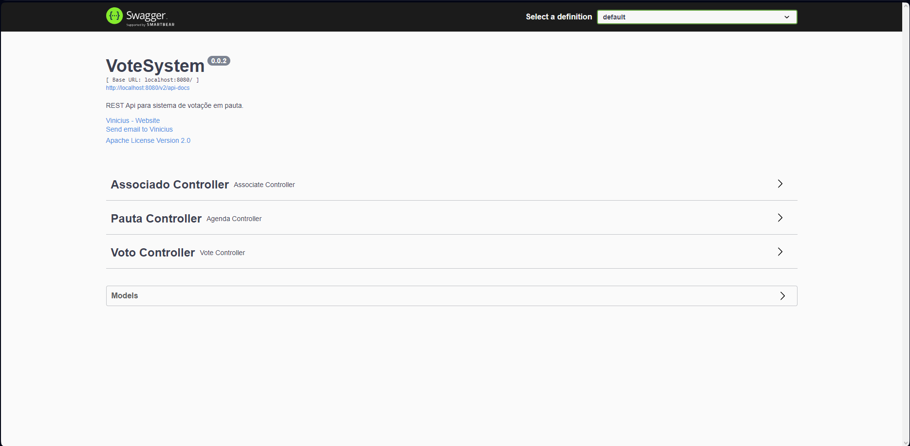

# VoteSystem

O VoteSystem é uma aplicação java para gerenciar sessões, com ela podemos criar várias sessões com tempo determinado para votação e votar apenas uma vez por associado, e assim que o tempo de votação acabar, gera o resultado da assembleia.

## 🚀 Começando

Essas instruções permitirão que você obtenha uma cópia do projeto em operação na sua máquina local para fins de desenvolvimento e teste.


### 📋 Pré-requisitos

Para executar o projeto, é necessário ter:
1. docker
2. docker-compose
3. maven


## 📦 Como rodar a aplicação

1. Antes de tudo, devemos clonar o projeto:
```
Clone este repositório: git clone https://github.com/viniciius083/VoteSystem.git
```

2. Acesse o diretório do projeto:
```
cd VoteSystem
```

3. Rode o comando para criar e iniciar os containers:
```
docker-compose up
```

4. Com isso, é preciso abrir outra linha de comando e acessar o diretorio 
do projeto, após isso ele vai rodar os testes também:
```
mvn clean install
```


5. Após isso, só falta rodar o projeto em si:
```
mvn spring-boot:run
```


6. Com isso, temos a [pagina inicial](http://localhost:8080) do projeto com a documentação do Swagger:



## 📌 Versão

É utilizado o padrão [Keep a Changelog](https://keepachangelog.com/en/1.0.0/) para controle de versão.

## ✒️ Autores


* **Vinicius** - *Desenvolvedor* - [Vinicius](https://github.com/viniciius083)


